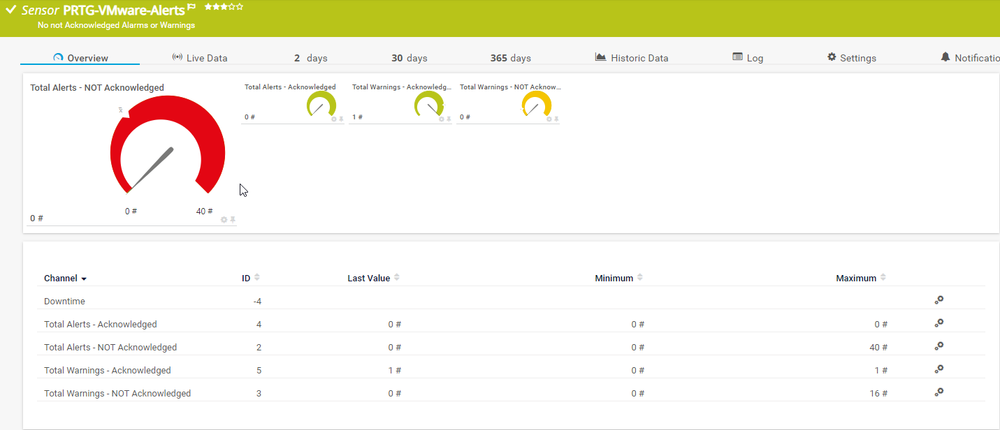
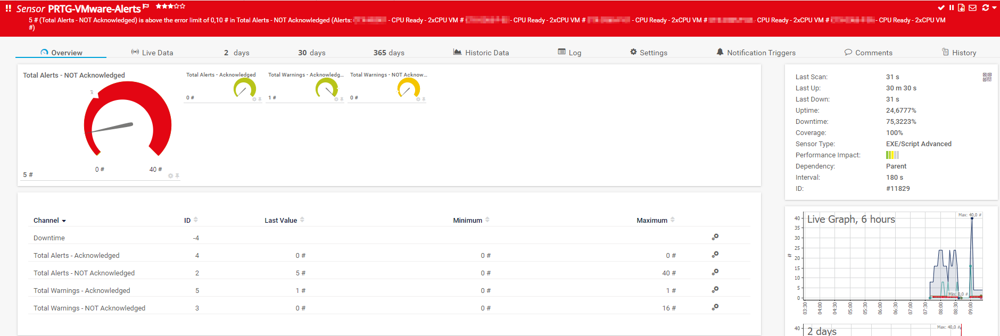

# PRTG-VMWare-Alerts
# About

## Project Owner:

Jannos-443

## Project Details

Using VMWare PowerCLI this Script checks VMware Alerts.
You can exclude specific Alarms or VMs. (see Alarm/VM exceptions)
All Acknowledged Alarms/Warnings are counted but only for logging.

## HOW TO

1. Make sure the VMware PowerCLI Module exists on the Probe under the Powershell Module Path
   - `C:\Program Files\WindowsPowerShell\Modules\VMware.VimAutomation.Core`

2. Place `PRTG-VMware-Snapshot-Alerts.ps1` under `C:\Program Files (x86)\PRTG Network Monitor\Custom Sensors\EXEXML`

3. Create new Sensor

   | Settings | Value |
   | --- | --- |
   | EXE/Script | PRTG-VMware-Alerts.ps1 |
   | Parameters | -ViServer 'yourVCenter' -User 'yourUser' -Password 'yourPassword' |
   | Scanning Interval | 10 minutes |

4. Set the "$VMIgnorePattern" or "$VMIgnorePattern" parameter to exclude Alarms

## Examples

Alarm/VM exceptions
------------------
Exceptions can be made within this script by changing the variable **$AlarmIgnoreScript** or **$VMIgnoreScript**. This way, the change applies to all PRTG sensors 
based on this script. If exceptions have to be made on a per sensor level, the script parameter **$VMIgnorePattern** or **$AlarmIgnorePattern** can be used.

For more information about regular expressions in PowerShell, visit [Microsoft Docs](https://docs.microsoft.com/en-us/powershell/module/microsoft.powershell.core/about/about_regular_expressions).

".+" is one or more charakters
".*" is zero or more charakters
